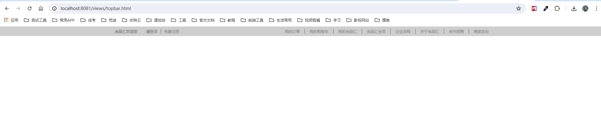
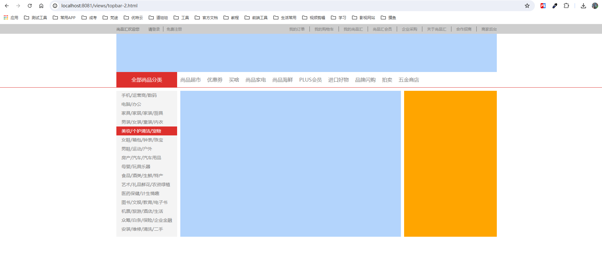
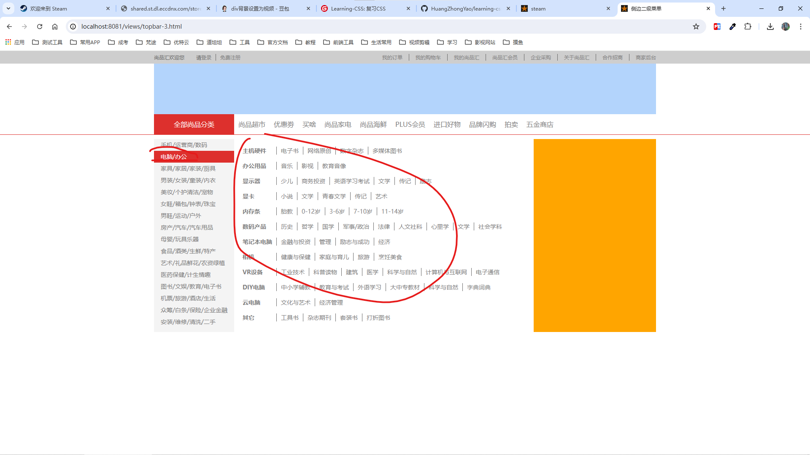
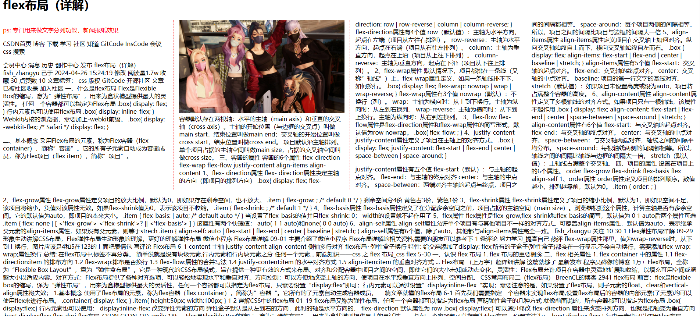
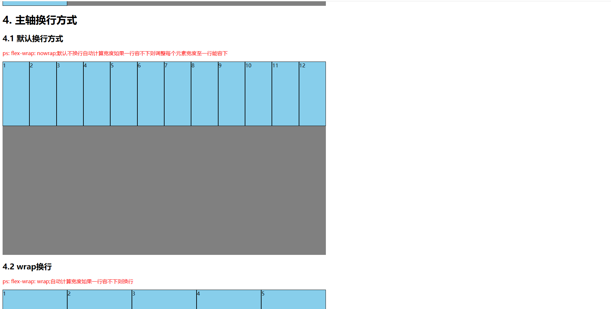
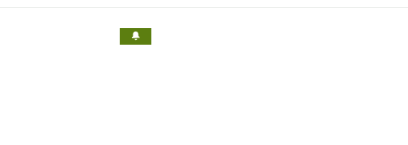
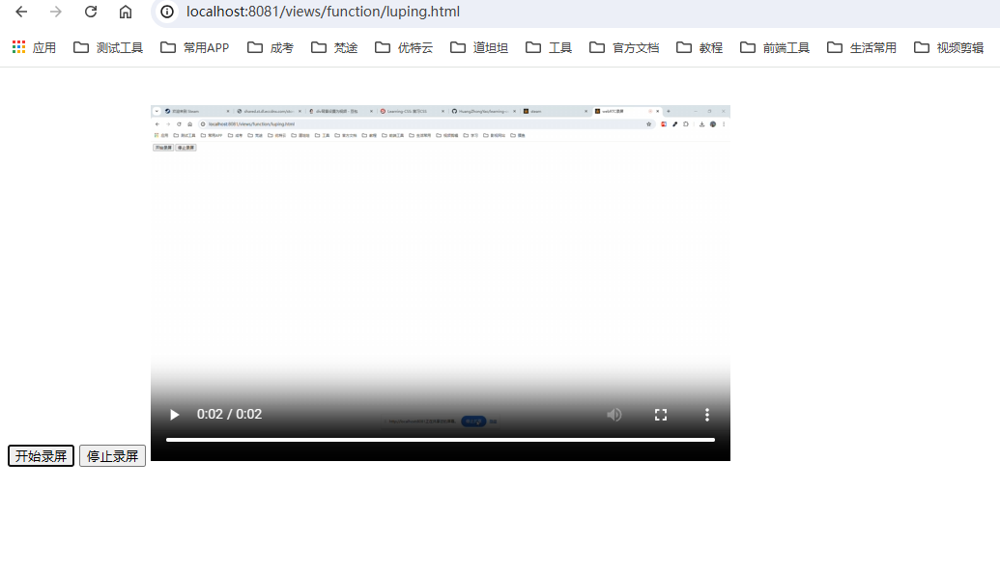
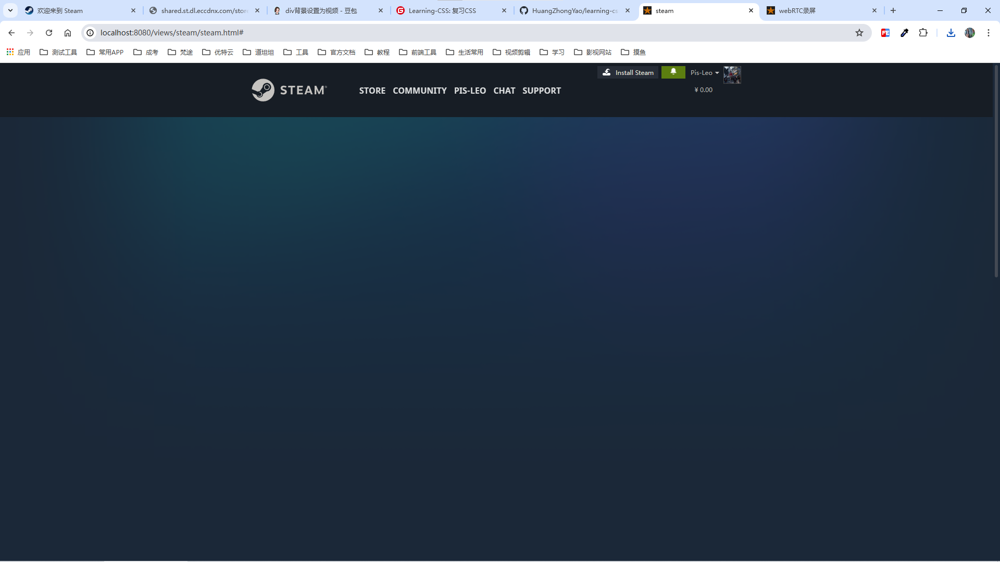

# Learning-CSS

#### 介绍

复习CSS，实现一些小效果

#### 安装教程

1.  npm install
2.  npm run start

#### css 编写一些效果复习前端css

1.  顶部导航

2.  侧边栏菜单

3.  侧边栏菜单二级菜单

4.  多列布局

5. Flex布局

6. 仿Steam铃铛晃动效果

7. web实现录屏

8. 模仿Steam首页

